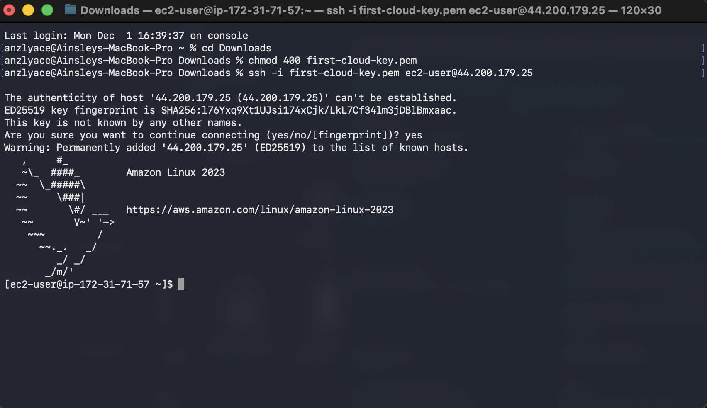
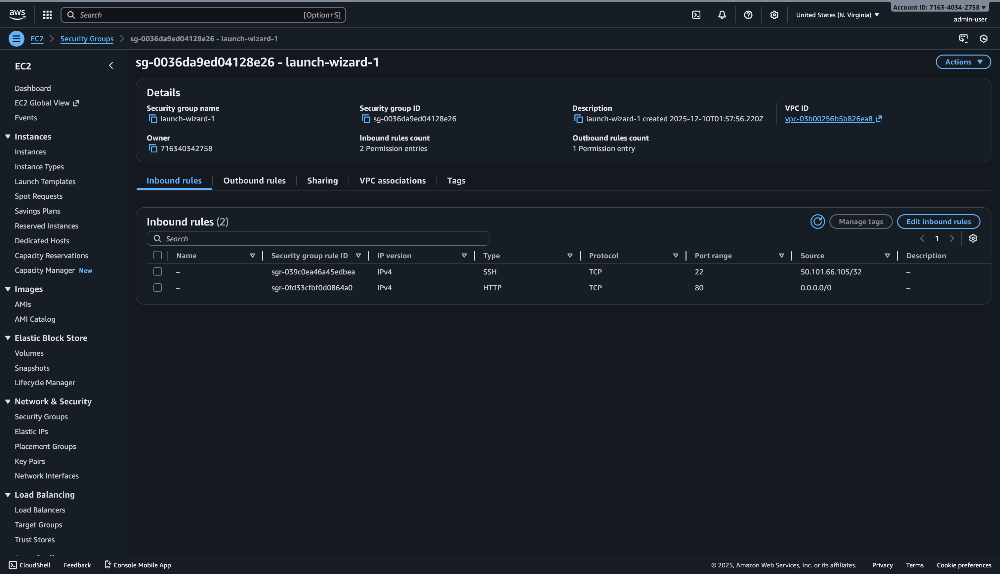
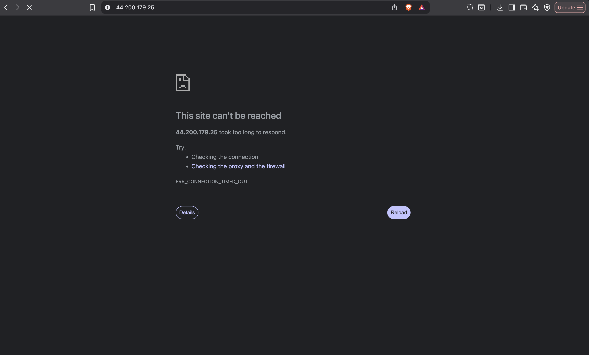
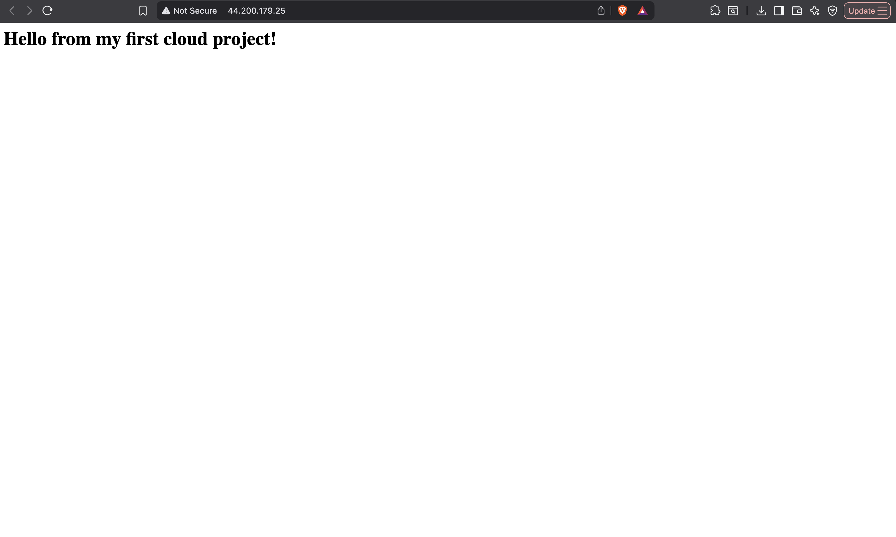

# AWS First Cloud Lab

## Overview
This project was my first hands on experience working with AWS.
The goal was to understand how cloud servers work by launching an EC2 instance, setting up a web server, and making it accessible over the internet.

---

## What I did
In this lab, I:
- Launched an Amazon EC2 instance using Amazon Linux
- Connected to the instance using SSH
- Installed and configured the Apache HTTP Server
- Created a simple HTML webpage
- Configured AWS Security Groups to control inbound traffic
- Tested access using the instance public IPv4 address

---

## Technologies Used
- AWS EC2
- Amazon Linux
- Apache HTTP Server
- SSH
- AWS Security Groups
- GitHub

---

## What I Learned
Through this project, I learned how:
- Cloud servers are launched and managed using AWS
- SSH is used to securly access remote Linux machines
- Web servers run on Linux and serve content
- Security Groups act like firewalls in AWS
- Public access depends on both server configuration and network rules
- Documenting projects clearly helps explain technical work

---

## Screenshots

### EC2 Instance Running

### SSH Connection to the Instance

### Security Group Configuration

### HTTP Access Blocked (Before Rule Added)

### Webpage Accessible After Configuration

---

## Outcome By the end of this lab, I successfully hosted a webpage on AWS and confirmed that it was only accessible after correctly configuring the security rules. This project helped me better understand how cloud infrastructure, networking, and security work together.
